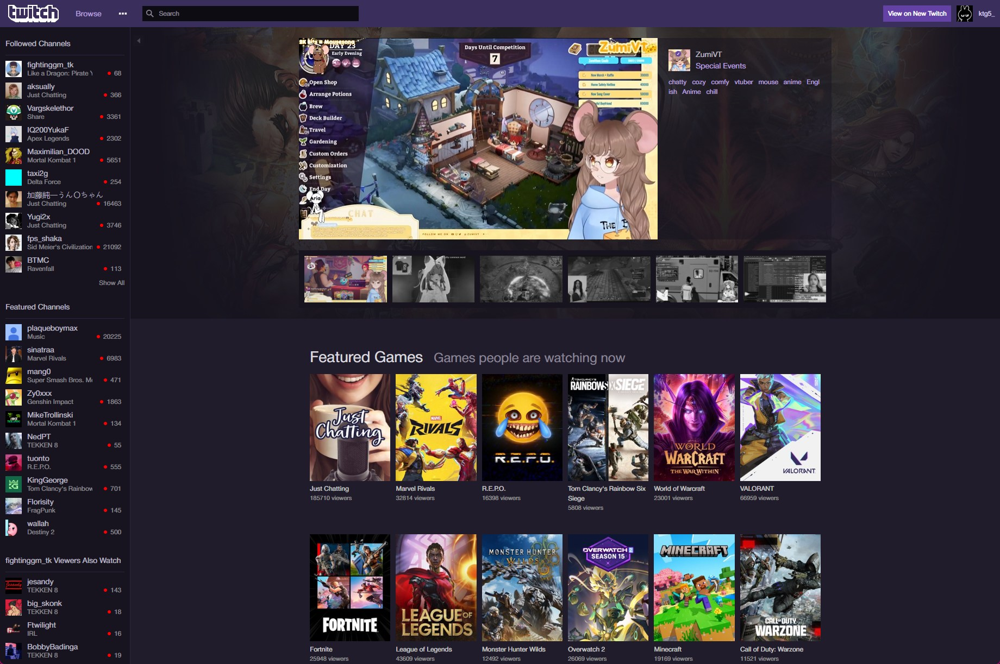
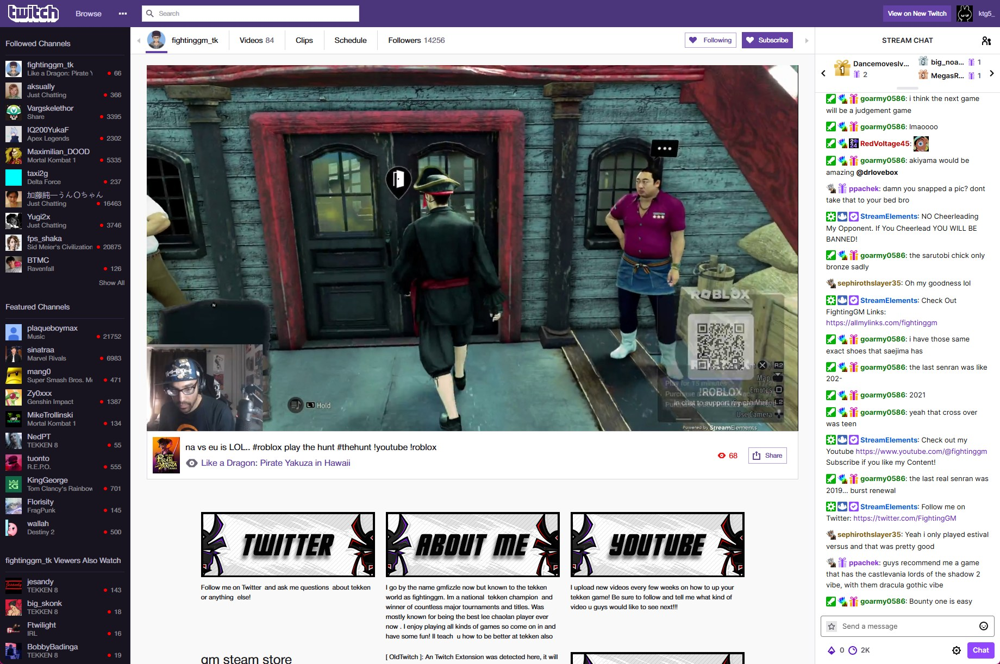
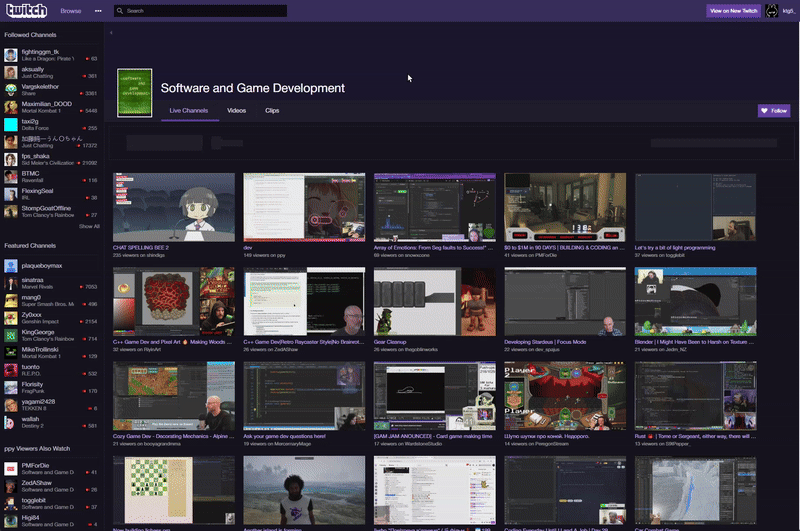
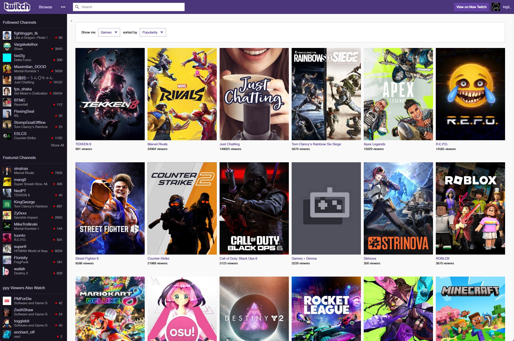

<h1 align="center">OldTwitch <kbd>0.0.4</kbd></h1>

A browser extension to bring back the old Twitch look.

For the moment, please download OldTwitch from the <a href="https://github.com/ktg5/OldTwitch/actions/workflows/build.yml">Actions page for more recent builds</a>, or the <a href="https://github.com/ktg5/OldTwitch/releases">Releases page for older builds</a>

  
  
  

## Screenshots
Screenshots taken from dev3:0.0.4

    
     
    <i>The Twitch index/home page, displaying featured streams & games.</i>
     
     
    
     
    <i>The Twitch watch page, showing the streamer, "fightinggm_tk", playing, "Like a Dragon: Pirate Yakuza in Hawaii" in the center, & their chat on the right.</i>
     
     
    
     
    <i>The Twitch category page, showing streams, videos (known as VODs) & clips of the Twitch category, "Software and Game Development".</i>
     
     
    
     
    <i>The Twitch discovery page, showing categories that the current user follows & other categories that Twitch recommends.</i>

## Todo
- [x] version checking.

- [ ] figure out how to get the video-swap script to work for the embeds showing streams & vods. (using as a userscript works fine, but when imported as a html script, no worky) 

- [ ] add the whole 2018 & 2015 twitch site.
    - [x] 2018: https://web.archive.org/web/20180223002421mp_/https://www.twitch.tv/, https://web.archive.org/web/20180223010527/https://www.twitch.tv/xqcow & https://youtu.be/DdQM-YauwJk?t=90s
    - [ ] 2014/15: https://www.webdesignmuseum.org/gallery/twitch-in-2014
- [ ] remove/replace unused css within `2018.css`. (might just remove the unused ones tbh)

- [x] make the extension replace the select pages with custom ones.
    - [ ] make the page replacer better, aka no need to fully replace or refresh the current page.

- [x] get an api key or something to get the user's stats, such as following, recommends, etc. and also use for streamer stats.
- [ ] figure out if there's a way to make event listeners from the gql api. (like listen for when a streamer goes live or viewer count changes & not have to call the api with a internal or somethin')

- [x] finish home page.

- [x] stream page.
    - [x] show list of streamer's vods & clips via a little category page added within the watch page.
    - [ ] follow & unfollow. (might be impossible cuz of the `client-integrity` value)

- [x] discovery page.
    - [x] game pages.
    - [x] the "all" discovery page found via home page or the "Browse" button.

- [x] get channel list working.
- [x] vods & clips.

- [x] channel list show all button.
    - [x] figure out why the following list in the channel list doesn't fetch sometimes.
- [x] subscribe button for those with sub page.
- [x] share button.
- [x] sidebar minimize buttons.

- [x] detect if a user is logged in
    - [x] make custom balloon with list of buttons that would appear when clicking

- [ ] search page &/or bar.

- [ ] settings page.

- [x] get 7tv to somehow inject into a embeds. (just use the ffz extension & install the 7tv plugin, works like a charm)
- [ ] make scripts & css for embedded video & chat. (video & live stream css is up, chat - not yet - have to make)
