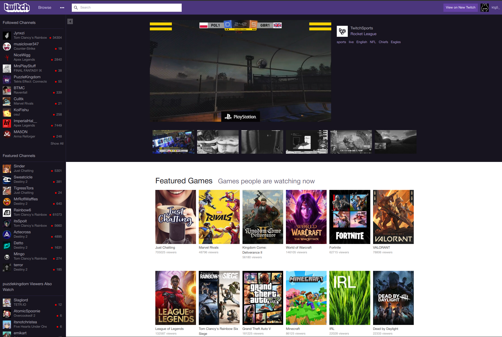
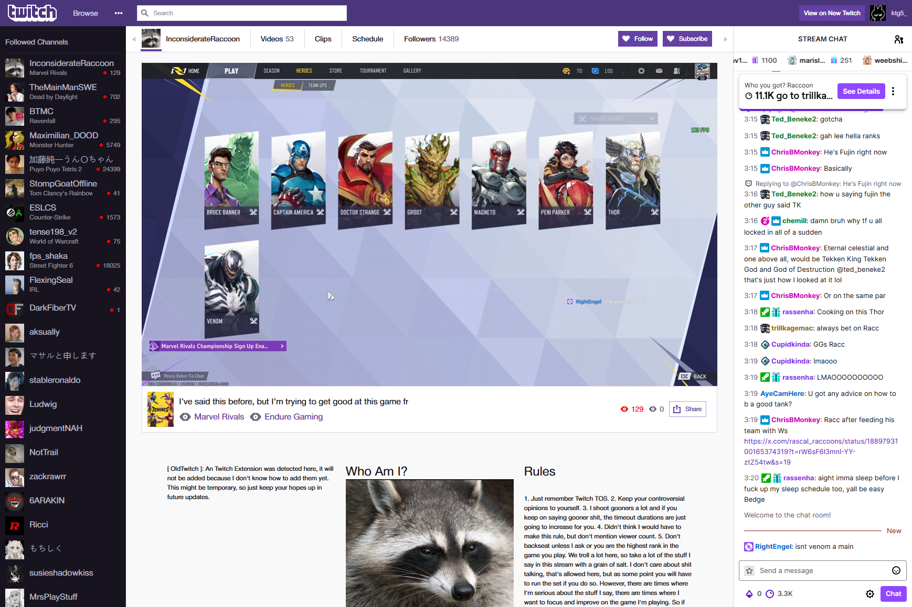
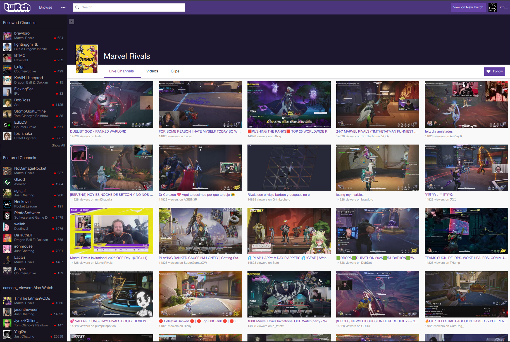

# oldttv
download from the Actions page (more recent builds) or Release page (a little more outdated) for the moment please & thank you

## screenshots
taken from dev4:0.0.2 & dev3:0.0.2

## todo
- [x] version checking

- [ ] figure out how to get the video-swap script to work for the embeds showing streams & vods (using as a userscript works fine, but when imported as a html script, no worky) 

- [ ] add the whole 2018 & 2015 twitch site.
    - [x] 2018: https://web.archive.org/web/20180223002421mp_/https://www.twitch.tv/, https://web.archive.org/web/20180223010527/https://www.twitch.tv/xqcow & https://youtu.be/DdQM-YauwJk?t=90s
    - [ ] 2014/15: https://www.webdesignmuseum.org/gallery/twitch-in-2014
- [ ] remove/replace unused css within `2018.css`. (might just remove the unused ones tbh)

- [x] make the extension replace the select pages with custom ones.
    - [ ] make the page replacer better, aka no need to fully replace or refresh the current page.

- [x] get an api key or something to get the user's stats, such as following, recommends, etc. and also use for streamer stats.
- [ ] figure out if there's a way to make event listeners from the gql api. (like listen for when a streamer goes live or viewer count changes & not have to call the api with a internal or somethin')

- [x] stream page
    - [ ] follow & unfollow. (might not be possible cuz of the `client-integrity` value)
    - [ ] show list of streamer's vods & clips via a little category page added within the watch page. (working on atm)

- [x] get channel list working.
- [x] vods & clips.

- [x] channel list show all button.
- [x] figure out why the following list in the channel list doesn't fetch sometimes.
- [x] subscribe button for those with sub page.
- [x] share button.
- [x] sidebar minimize buttons.

- [x] finish home page.

- [ ] search & categories. (semi working atm)

- [x] get 7tv to somehow inject into a embeds. (just use the ffz extension & install the 7tv plugin, works like a charm)
- [ ] make scripts & css for embedded video & chat. (video & live stream css is up, chat - not yet - have to make)