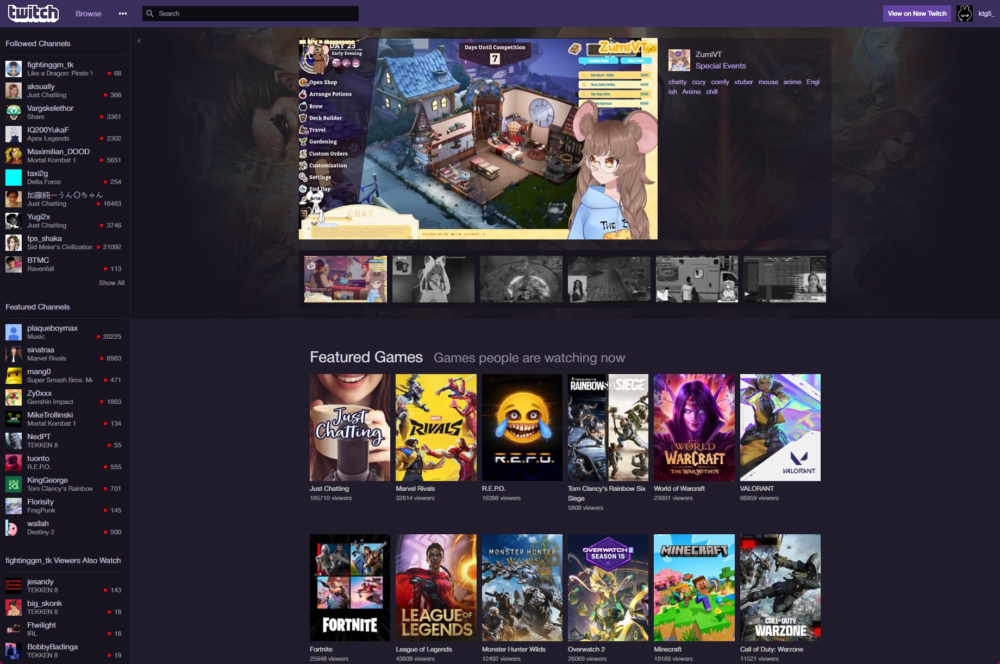
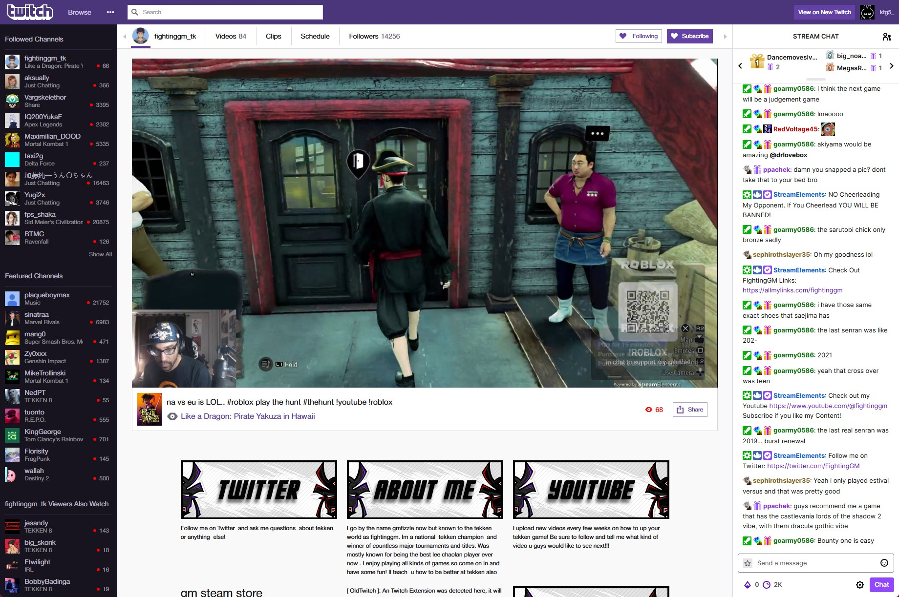
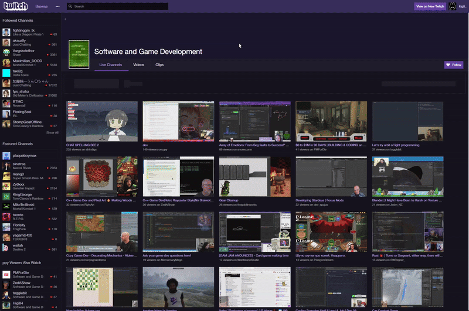
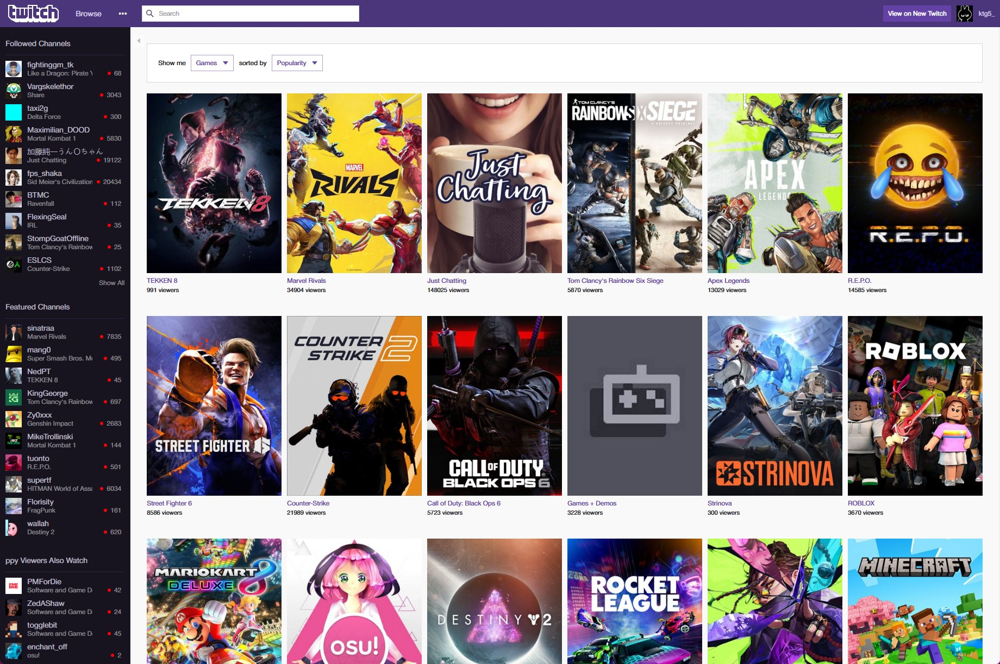

<h1 align="center">OldTwitch</h1>

A browser extension to bring back the old Twitch look.

<b>For the moment, please download OldTwitch from the <a href="https://github.com/ktg5/OldTwitch/actions/workflows/build.yml">Actions page for more recent builds</a>, or the <a href="https://github.com/ktg5/OldTwitch/releases">Releases page for older builds</a></b>

 

  
  
  

## Screenshots
Screenshots taken from dev3:0.0.4

    
     
    <i>The Twitch index/home page, displaying featured streams & games.</i>
     
     
    
     
    <i>The Twitch watch page, showing the streamer, "fightinggm_tk", playing, "Like a Dragon: Pirate Yakuza in Hawaii" in the center, & their chat on the right.</i>
     
     
    
     
    <i>The Twitch category page, showing streams, videos (known as VODs) & clips of the Twitch category, "Software and Game Development".</i>
     
     
    
     
    <i>The Twitch discovery page, showing categories that the current user follows & other categories that Twitch recommends.</i>

## Installing for YOU!
1. ⚠️ IMPORTANTE!!! ⚠️ Make sure you're logged into a GitHub account, or else you can't download any files from the Actions tab, which is where the Beta / Dev builds are stored.
2. Go to the [`OldTwitch build-n-pack` workflow in the Actions tab](https://github.com/ktg5/OldTwitch/actions/workflows/build.yml) and click on the latest workflow run at the top of the list.
3. Download the Artifact for your browser (For Chrome, Opera, Brave, etc. users: get the Chromium-based Build. For Firefox, Zen, Waterfox, etc. users: get the Firefox-based build).
4. If you're not using a Firefox-based browser, extract all the files from the ZIP file into a folder.
5. Load the extension on your browser, which is explained below.
### Chromium browsers (Chrome, Opera, Brave).
* For Chromium-based browsers, open a new tab and go to `chrome://extensions`.
* Make sure the `Developer mode` switch is enabled at the top right.
* Click on `Load unpacked` at the top left, and navigate to the folder which has the extension.
### Firefox-based browsers!!!
Before going about this, please make sure you disable `xpinstall.signatures.required` in your `about:config`.
* Go to `about:addons`
* Click on the gear icon below the search bar at the top right of the page, and click on `Install Add-on From Files...`
* Navigate to the ZIP file of the extension.

## Want to learn about stuff behind the scenes?
* [Learn about the GQL operations & Hermes WebSocket](operations/)

## [Todo](TODO.md)
